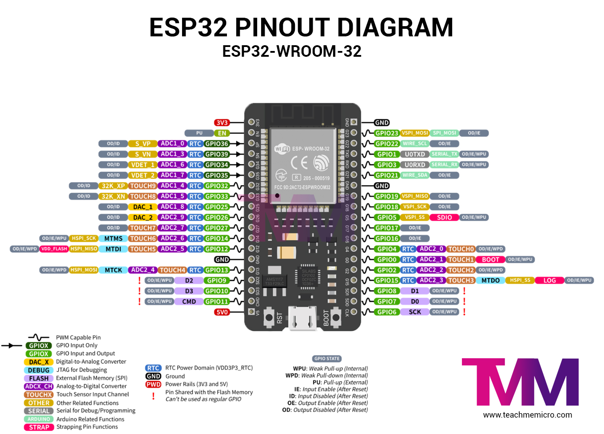

<p align="center">
  <a href="http://iot.nipoanz.com/" target="blank"></a>
</p>

# Nodos de Telemetría - IOT

Ver el proyecto en [http://iot.nipoanz.com/](http://iot.nipoanz.com/)

## Descripción del Proyecto
Este proyecto de telemetría de variables ambientales está diseñado para monitorear en tiempo real factores como la luz, la humedad, y la temperatura, este se encuentra desarrollado en MicroPython y se ejecuta en un microcontrolador ESP32. Esta es una mejora y modernización del script desarrolado sobre Arduino, el cual se puede encontrar en este [enlace](main.ino), el cual se encuentra en el repositorio de este proyecto.

Este proyecto tambien cuenta con un frontend desarrollado en Next.js, el cual se puede acceder en el siguiente [link](https://iot.nipoanz.com), y este tambien cuenta con un repositorio el cual se llama [next-weather-station](https://github.com/potier97/next-wheather-station).

La solución es fundamental para entornos que dependen de condiciones ambientales óptimas, como invernaderos, laboratorios, y almacenamiento de productos sensibles. 

El sistema recopila datos de sensores como DHT21 y VEML6070, los cuales almacena de manera segura en la base de datos de tiempo real de Firebase, y además de guardarlos en una tarjeta SD local para persistencia de la información en caso de fallos de conexión.

## Tarjeta y Dispositivo desarrollado

<p align="center">
  
</p>

Este proyecto se basa en una tarjeta de desarrollo personalizada que integra un microcontrolador ESP32, sensores de luz, temperatura y humedad, y una ranura para tarjeta SD. La tarjeta está diseñada para ser compacta y fácil de usar, lo que la hace ideal para aplicaciones de IoT y telemetría en entornos industriales y comerciales.

### Dispositivo final

<p align="center">
  
</p>


### Conexionado de la tarjeta

El siguiente es el esquematico de pinout de la tarjeta ESP32

<p align="center">
  
</p>

Las conexiónes al dispositivo correponde a la siguiente tabla:

| Sensor | ESP32 Pin (GPIO) |
| ------ | --------- |
| DHT21  | 17 Salida Digital |
| VEML6070 | 16 (power) 21 (SDA) 22 (SCL) |
| SD Card | 18 (SCK) 23 (MOSI) 19 (MISO) 5 (CS) |
| LED     | 12 Salida Digital |

 - **DHT21**: Sensor de temperatura y humedad
 - **VEML6070**: Sensor de luz UV
 - **SD Card**: Tarjeta SD para almacenamiento local
 - **LED**: Indicador de estado

Esta tarjeta se ha desarrollado mediante `EasyEDA` y se ha fabricado en `JLCPCB`. Puede encontrar el diseño compartido [aqui](https://oshwlab.com/nicolaspotier97/iot-node-2).

<p align="center">
  
</p>

## Funcionalidades

 - **Monitoreo Continuo**: Permite un control constante de las condiciones ambientales, crucial para mantener la calidad y la estabilidad de los productos o experimentos.
 - **Automatización de Alertas**: Genera alertas automáticas en caso de que las variables ambientales superen los límites definidos, ayudando a prevenir pérdidas y mantener la conformidad con las normas.
 - **Acceso Remoto a Datos**: Con la integración en la nube, los datos pueden ser monitoreados desde cualquier lugar, facilitando la gestión descentralizada de los activos.
 - **Escalabilidad**: El sistema puede ser expandido fácilmente para monitorear otras variables o para implementar en múltiples ubicaciones sin necesidad de cambios significativos.

## Características Clave
 - **Recopilación de Datos Ambientales**: Medición precisa de luz, temperatura, y humedad utilizando sensores avanzados conectados a un microcontrolador (ESP32 de Espressif).
 - **Almacenamiento Local y en la Nube**: Los datos se guardan en una tarjeta SD y se sincronizan con una base de datos en Firebase para su análisis posterior.
 - **Conectividad Wi-Fi**: Permite la transmisión de datos en tiempo real a través de Wi-Fi, asegurando que la información esté siempre disponible.
 - **Manejo de Energía Eficiente**: El dispositivo está optimizado para operar en modo de bajo consumo, maximizando la vida útil del dispositivo en ubicaciones remotas.

## Instalación

Requisitos Previos
- Hardware Necesario:
  - Microcontrolador ESP32.
  - Sensor de humedad, temperatura (DHT21)
  - Sensor de luz UV (Adafruit VEML6070).
  - Tarjeta SD y módulo lector.

- Conexión Wi-Fi disponible.

- Software Necesario:
 - Python: Para ejecutar y modificar el código del proyecto.
 - MicroPython: Firmware necesario para correr el código en el ESP32.
 - ampy: Herramienta para cargar el código al microcontrolador.

## Configuración del Entorno
Instalación del Firmware MicroPython en el ESP32:
 1. Descarga la última versión del firmware de MicroPython para ESP32.
 2. Flashea el firmware al ESP32 usando esptool.py. - Lo puede hacer siguiendo las instrucciones en el siguiente [reposirotio](https://github.com/potier97/micropython-config).

### Instalación de Dependencias:

 - Instala ampy para cargar los scripts en el ESP32.

```bash
pip install adafruit-ampy

```
- Cargar el Código al ESP32:

```bash
ampy --port  put main.py
ampy --port COM3 put config.py
```

### Configuración del Sistema

 - Configuración de archivo config.py:

Este archivo contiene las credenciales de Wi-Fi y Firebase necesarias para la conexión y el almacenamiento de datos, además el api key de google para poder consumir el api de geolocalización. Asegúrate de que la configuración de la red Wi-Fi está correctamente especificada en config.py:

 > **Importante**: Puede ver la sigueinte documentación de google para ver como funciona el api de  [geo-localización](https://developers.google.com/maps/documentation/geolocation/requests-geolocation?hl=es-419#java)

 > Es importante tener un proyecto de Firebase y una cuenta de Google GCP para poder consumir el api de geolocalización.

```python
ssid = 'XXXXXX'
password = 'XXXXXX'
api_key = 'XXXXXX'
firebase_api_key = 'XXXXXX'
firebase_email = 'XXXXXX'
firebase_password = 'XXXXXX'
firebase_database_url = 'XXXXXX'
sleep_time = 600 
sensor_name = "sensor1"
```
 > Este archivo debe ser cargado al ESP32 junto con el archivo main.py.

Las variables `api_key`, `firebase_api_key`, `firebase_email`, `firebase_password`, `firebase_database_url`, `sleep_time`, `sensor_name` deben ser reemplazadas con los valores correspondientes.

 - ssid: Nombre de la red Wi-Fi.
 - password: Contraseña de la red Wi-Fi.
 - api_key: Api key de google para consumir el api de geolocalización.
 - firebase_api_key: Api key de Firebase.
 - firebase_email: Correo electrónico de la cuenta creada en Firebase en el servicio de authentication
 - firebase_password: Contraseña de la cuenta creada en Firebase en el servicio de authentication
 - firebase_database_url: URL de la base de datos en Firebase (tiempo real).
 - sleep_time: Tiempo en segundos que el dispositivo estará en modo de inactivo (deep sleep) y despertará para tomar una nueva lectura.
 - sensor_name: Nombre del sensor, este se utiliza para identificar el sensor en la base de datos.


## Carga de Scripts al ESP32

Teniendo el firmware de MicroPython instalado en el ESP32 y las dependencias necesarias configuradas, puedes cargar los scripts al microcontrolador utilizando ampy:

```bash
ampy --port COM3 put .\module\boot.py boot.py
ampy --port COM3 put .\module\sdcard.py sdcard.py
ampy --port COM3 put .\scripts\config.py config.py
ampy --port COM3 put .\scripts\dht_sensor.py dht_sensor.py
ampy --port COM3 put .\scripts\firebase.py firebase.py
ampy --port COM3 put .\scripts\geolocation.py geolocation.py
ampy --port COM3 put .\scripts\node.py node.py
ampy --port COM3 put .\scripts\ntp.py ntp.py
ampy --port COM3 put .\scripts\sd.py sd.py
ampy --port COM3 put .\scripts\uv.py uv.py
ampy --port COM3 put .\scripts\main.py main.py
```

> De acuerdo a la estructura de este proyecto, todos los scripts ubicados en la carpeta `scripts` se deben cargar al ESP32.

> El script `main.py` es el script principal que se ejecutará en el ESP32 y este debe ser cargado de ultimo para evitar bloqueos en el microcontrolador.

## Funcionamiento

### DHT sensor

Corresponde al Script [`dht_sensor.py`](./scripts/dht_sensor.py)

Este script se encarga de manejar la lectura de los sensores de temperatura y humedad DHT22. El sensor mide la temperatura y la humedad, y también calcula la sensación térmica (heat index) basada en estos valores.

**Funcionamiento**:
 - DHTSensor Clase: Inicializa el sensor DHT22 y define los métodos para leer los valores de temperatura y humedad.
 - read() Método: Lee los valores del sensor y calcula la sensación térmica.
 - compute_heat_index() Método: Calcula la sensación térmica (heat index) usando una fórmula empírica simplificada.

```python	
sensor = DHTSensor(pin=14)
temperature, humidity, heat_index = sensor.read()
print("Temperature:", temperature, "C")
print("Humidity:", humidity, "%")
print("Heat Index:", heat_index, "C")
```

### UV sensor

Corresponde al Script [`uv.py`](./scripts/uv.py)

Leer el índice de radiación UV utilizando un sensor de UV conectado al pin especificado del microcontrolador.


**Funcionamiento**:
 - UVSensor Clase: Inicializa el sensor UV y define el método para leer el índice UV.
 - read_uv_index() Método: Lee el valor del sensor UV, lo convierte a un índice UV y lo devuelve.
 


```python
veml6070Pin = Pin(16, Pin.OUT)
veml6070Pin.value(1)
i2c = SoftI2C(scl=Pin(22), sda=Pin(21))
uv_sensor = VEML6070(i2c)
uv_index = uv_sensor.read_uv_index()
print("UV Index:", uv_index)
```

### Geolocalización

Corresponde al Script [`geolocation.py`](./scripts/geolocation.py)

Este script se encarga de obtener la geolocalización del dispositivo utilizando la API de Google Maps. La geolocalización se obtiene a partir de la dirección IP del dispositivo y se almacena en la base de datos de Firebase.

**Funcionamiento**:
 - Geolocation Clase: Define el método para obtener la geolocalización del dispositivo utilizando la API de Google Maps.
 - get_geolocation() Método: Obtiene la dirección IP del dispositivo, la envía a la API de Google Maps y almacena la geolocalización en la base de datos de Firebase.

```python
geolocation = Geolocation()
lat, lng = geolocation.get_coordinates()
print(f"Latitude: {lat}, Longitude: {lng}")
```

### Firebase

Corresponde al Script [`firebase.py`](./scripts/firebase.py)

Este script se encarga de manejar la conexión con la base de datos de Firebase y de almacenar los datos de los sensores en tiempo real.

**Funcionamiento**:
 - Firebase Clase: Inicializa la conexión con la base de datos de Firebase y define los métodos para almacenar y recuperar datos.
 - authenticate() Método: Autentica el usuario en Firebase utilizando el correo electrónico y la contraseña.
- save_data() Método: Almacena los datos de los sensores en la base de datos de Firebase.

```python
node_name = "sensor1"
data = {
    "temperature": 25.0,
    "humidity": 60.0,
    "heat_index": 26.0,
    "uv_index": 5.0,
    "latitude": 37.7749,
    "longitude": -122.4194
}
firebase = Firebase(api_key, email, password, database_url)
token = firebase.authenticate()
firebase.save_data(token, node_name, data)
```

### Node

Corresponde al Script [`node.py`](./scripts/node.py)

Este script se encarga de coordinar la lectura de los sensores, la geolocalización y el almacenamiento de los datos en la base de datos de Firebase. El nodo se encarga de manejar el ciclo de lectura de los sensores y de enviar los datos a la base de datos.

**Funcionamiento**:
 - Node Clase: Inicializa los sensores, la geolocalización y la conexión con Firebase, y define el método para ejecutar el ciclo de lectura y almacenamiento de datos.
 - run() Método: Ejecuta el ciclo de lectura de los sensores y el almacenamiento de datos en la base de datos.

```python
sensor_name = "sensor1"
led = 2
sleep_time = 600
node = Node(sensor_name, led, sleep_time)
node.run()
```

### NTP

Corresponde al Script [`ntp.py`](./scripts/ntp.py)

Este script se encarga de sincronizar el reloj del ESP32 con un servidor NTP para asegurar la precisión de las marcas de tiempo en los datos almacenados en la base de datos.

**Funcionamiento**:
 - NTP Clase: Define el método para sincronizar el reloj del ESP32 con un servidor NTP.
 - sync_time() Método: Sincroniza el reloj del ESP32 con un servidor NTP.

```python
ntp = NTP()
ntp.sync_time()
```

### SD

Corresponde al Script [`sd.py`](./scripts/sd.py)

Este script se encarga de manejar la lectura y escritura de datos en una tarjeta SD conectada al ESP32. Los datos se almacenan en un archivo CSV en la tarjeta SD para su persistencia en caso de fallos de conexión.

**Funcionamiento**:
 - SD Clase: Inicializa la tarjeta SD y define los métodos para leer y escribir datos en un archivo CSV.
 - write_data() Método: Escribe los datos de los sensores en un archivo CSV en la tarjeta SD.
 - read_data() Método: Lee los datos de un archivo CSV en la tarjeta SD.

```python
sd = SDCard(spi_sck=18, spi_mosi=23, spi_miso=19, cs_pin=5)
file_name = "data.csv"
data = {
    "temperature": 25.0,
    "humidity": 60.0,
    "heat_index": 26.0,
    "uv_index": 5.0,
    "latitude": 37.7749,
    "longitude": -122.4194
}
sd.write_data(file_name, data)
```

### Main

Corresponde al Script [`main.py`](./scripts/main.py)

Este script es el script principal que se ejecuta en el ESP32 y coordina la lectura de los sensores, la geolocalización y el almacenamiento de los datos en la base de datos de Firebase y en la tarjeta SD.

**Funcionamiento**:
 - Configuración de los pines y la conexión Wi-Fi.
 - Inicialización de los sensores, la geolocalización, la conexión con Firebase y la tarjeta SD.
 - Ciclo de lectura de los sensores, la geolocalización y el almacenamiento de los datos en la base de datos y la tarjeta SD.

```python
import config
from node import Node
sleep_time = config.sleep_time
sensor_name = config.sensor_name
led = 12
node = SensorNode(sensor_name, led, sleep_time)
node.run()
```

### Purebas

Datos sensados en la base de datos de Firebase:

<p align="center">
  
</p>

Datos Mostrados en la plataforma web:

<p align="center">
  
</p>

Visualización de la terminal:

<p align="center">
  
</p>
¿


## Uso

Este proyecto es esencial para cualquier organización que necesite monitorear condiciones ambientales de manera continua y fiable. La estructura del código basada en MicroPython y orientada a objetos asegura una solución escalable y fácil de mantener, lo que permite a las empresas adaptarse rápidamente a nuevas necesidades o regulaciones.

## Contribuir

1. Hacer un fork del repositorio.
2. Crear una nueva rama (`git checkout -b feature-nueva-funcionalidad`).
3. Hacer commit de los cambios (`git commit -am 'Agregar nueva funcionalidad'`).
4. Hacer push a la rama (`git push origin feature-nueva-funcionalidad`).
5. Crear un Pull Request.

## Licencia

Este proyecto está bajo la Licencia MIT.
